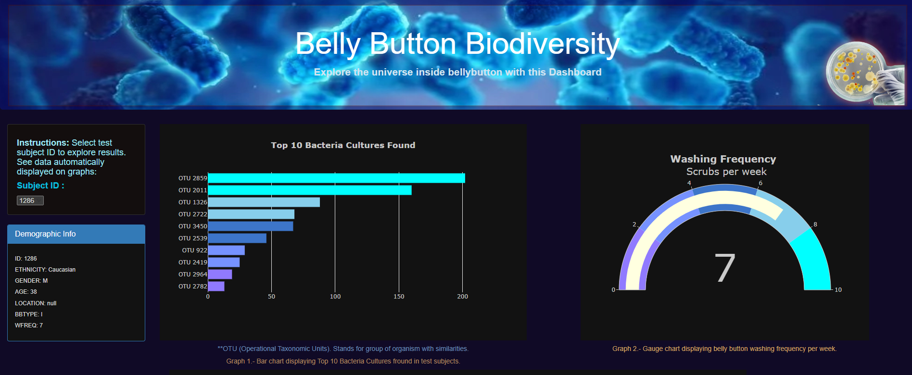
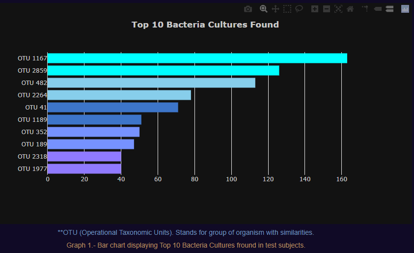
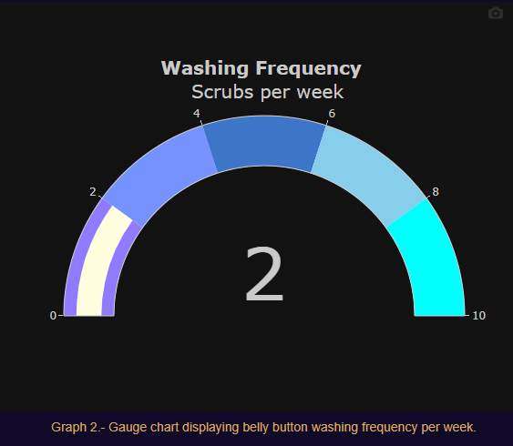
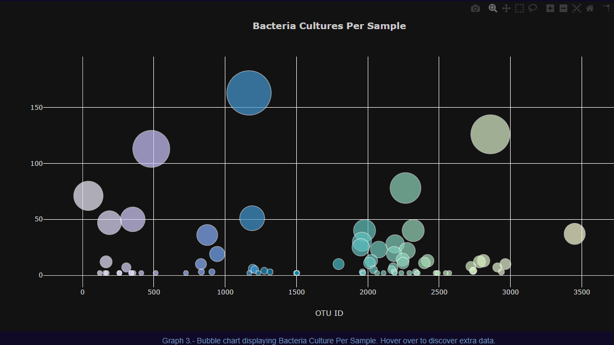

# Bellybutton Biodiversity Analysis

## Overview
The following project consisted on the creation of an interactive dashboard displaying data in different types of charts.

## Resources and languages

Tools included JavaScript, HTML, Plotly, Bootstrap and Visual Studio Code

## Website:
The following project visualization and testing can be done with the following [link](https://splt19.github.io/plotly_deployment/)

### Website screenshot samples:

Site consisted of an interactive dashboard able to adapt to different screen size. [sample1](Resources/sample1.png), [sample2](Resources/sample2.png), [sample3](Resources/sample3.png), [Sample4](Resources/sample4.png), [sample5](Resources/sample5.png).  

It includes: 

- Instructions and demographic information.

- Charts included
Bar Chart

Gauge Chart

Bubble Chart

=======

